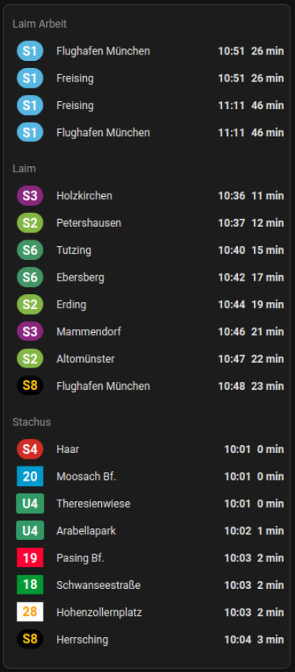

# Munich public transport (MVG) widget for Home Assistant

Custom sensor component and lovelace card that displays upcoming departures from your defined public transport stops for Munich.



## 🧑‍💻 Credits

This widget was forked from [vas3k](https://github.com/vas3k)'s [repository](https://github.com/vas3k/home-assistant-berlin-transport) and adopted to work for Munich using [mondbaron](https://github.com/mondbaron)'s [library for MVG's API](https://github.com/mondbaron/mvg).

## 💿 Installation

The component consists of two parts:

1. A sensor, which tracks departures via [MVG public API](https://github.com/mondbaron/mvg) every 90 seconds
2. A widget (card) for the lovelace dashboard, which displays upcoming transport in a nice way

We will look at the installation of each of them separately below.

### Install sensor component

**1.** Copy the whole [munich_transport](./custom_components/) directory to the `custom_components` folder of your Home Assistant installation. If you can't find the `custom_components` directory at the same level with your `configuration.yml` — simply create it yourself and put `munich_transport` there.

**2.** Go to Home Assistant web interface -> `Developer Tools` -> `Check and Restart` and click "Restart" button. It will reload all components in the system.

**3.** Now you can add your new custom sensor to the corresponding section in the `configuration.yml` file.

```yaml
sensor:
  - platform: munich_transport
    departures:
      - name: "Hohenzollernplatz" # exact name of the station, used to find it
      - name: "Barbarastraße" # you can add more that one stop to track
        # Optional parameter with value in minutes to hide transport sooner than N minutes
        walking_time: 5
        # Optional parameter with direction as a string to hide unwanted directions
        directions: "Romanplatz"
      - name: "Harras"
        # Example for multiple directions
        directions: ["Klinikum Großhadern", "Fröttmanning"]
      - name: "Ostbahnhof Muenchen"
        # Example for multiple Lines
        lines: ["S8", "S2"]
```

**4.** Restart Home Assistant core again and you should now see two new entities (however, it may take some time for them to fetch new data). If you don't see anything new — check the logs (Settings -> System -> Logs). Some error should pop up there.

### Add the lovelace card

When sensor component is installed and working you can add the new fancy widget for your dashboard.

**1.** Copy the [munich-transport-timetable-card.js](./www) card module to the `www` directory of your Home Assistant. The same way you did for the sensor above. If it doesn't exist — create one.

**2.** Go to your Home Assistant dashboard, click "Edit dashboard" at the right top corner and after that in the same top right corner choose "Manage resources".

**3.** Add new resource with URL: `/local/munich-transport-timetable-card.js` and click create. Go back to your dashboard and refresh the page.

**4.** Now you can add the custom card and integrate it with your sensor. Click "Add card -> Manual" or just go to "Raw configuration editor" and use this config.

```yaml
type: custom:munich-transport-timetable-card
show_stop_name: true # show or hide the name of your stop in card title
max_entries: 8 # number of upcoming departures to show (max: 10)
direction_name_max_length: 25 # optional: max length of displayed direction names (default: 30) 
entities:
- sensor.hohenzollernplatz # use your entity IDs here
- sensor.barbarastrasse # they might be different from mine
```

## 🎨 Styling

If you want to change any styles, font size or layout — the easiest way is to use [card_mod](https://github.com/thomasloven/lovelace-card-mod) component. It allows you to change any CSS classes to whatever you want.

## ❤️ Contributions

Contributions are welcome. Feel free to [open a PR](https://github.com/MrGauz/home-assistant-munich-transport/pulls) and send it to review. If you are unsure, [open an Issue](https://github.com/MrGauz/home-assistant-munich-transport/issues) and ask for advice.

## 🐛 Bug reports and feature requests

Since this is my small hobby project, I cannot guarantee you a 100% support or any help with configuring your dashboards. I hope for your understanding.

- **If you find a bug** - open [an Issue](https://github.com/MrGauz/home-assistant-munich-transport/issues) and describe the exact steps to reproduce it. Attach screenshots, copy all logs and other details to help me find the problem.
- **If you're missing a certain feature**, describe it in Issues and try to code it yourself. It's not hard.

## 👮‍♀️ License

- [MIT](./LICENSE.md)
